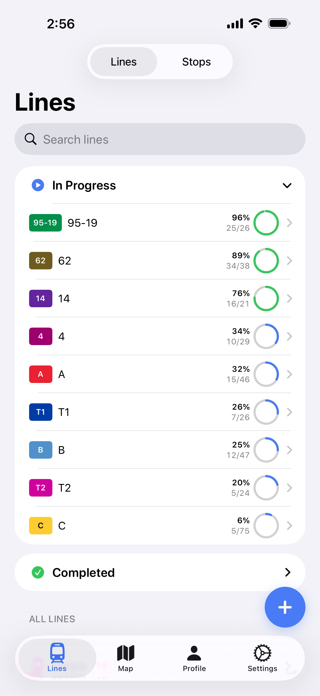
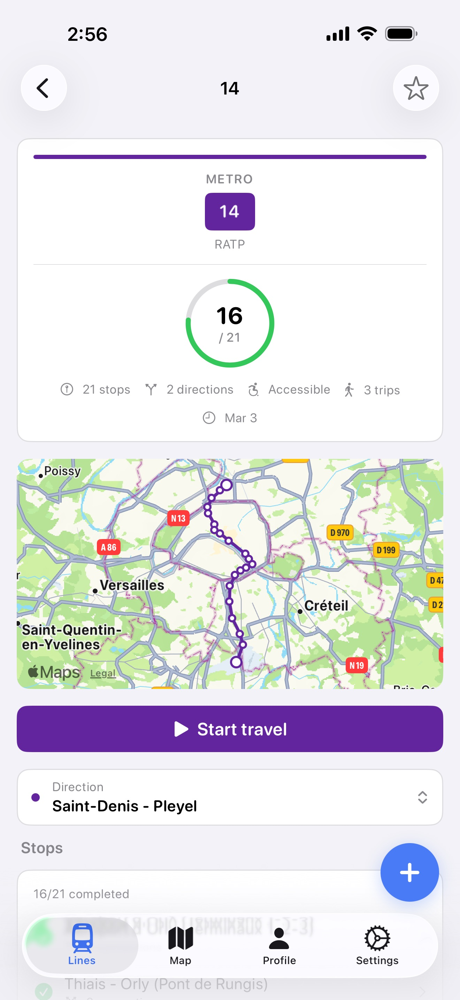
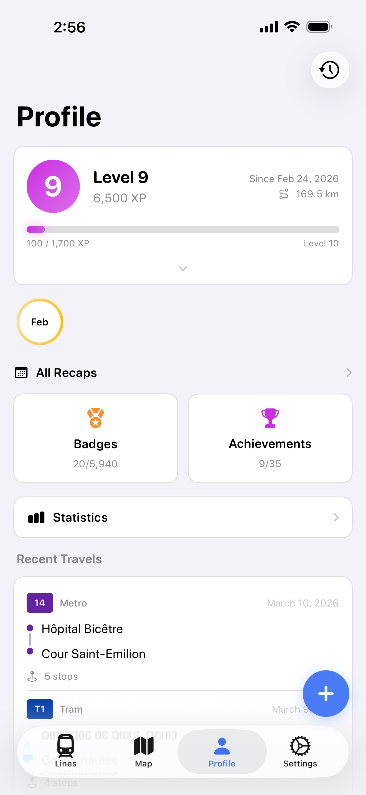
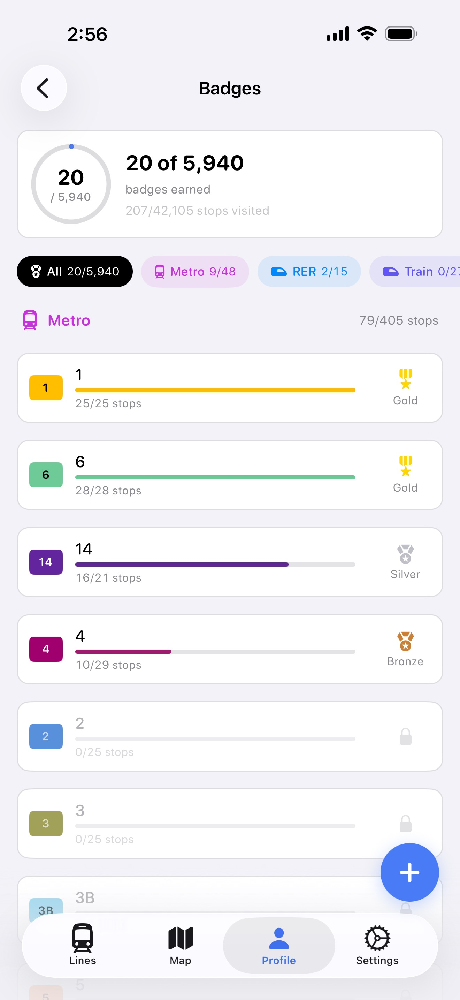
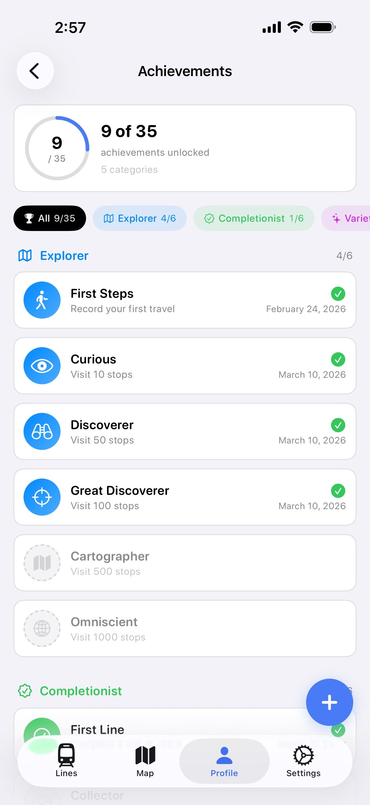

# Métropolist

A native iOS app to explore, track, and complete every transit station in the Paris region (Île-de-France), with gamification, iCloud sync, and zero dependencies.

<p align="center">
  
  
  
  
  
</p>

<p align="center">
  
  
  
  
  
</p>

<p align="center">
  <a href="https://apps.apple.com/app/id6759519940">
    
  </a>
</p>

## Features

- Browse all transit lines in the Paris region: Metro, RER, Train, Tram, Bus, Cable Car, Funicular, and more
- Track visited stations and log your travels across the network
- Search stations and lines across the entire network
- Find nearby stations based on your location
- Gamification system with XP, levels, badges, achievements, streaks, and secret discoveries
- View per-line and per-mode completion progress
- View line routes on an interactive map with heatmap overlay
- Browse your travel history on a timeline with animated route replay
- Monthly and yearly recaps with story cards
- Earn and share line completion certificates
- Detailed statistics: travel patterns, personal records, department and fare zone coverage
- Sync your progress across devices with iCloud
- Export and import your travel data as JSON
- Home screen widgets and quick actions
- Offline-first: all transit data is bundled with the app, no network required
- Fully native with zero third-party dependencies

## Supported Transit Modes

- Metro
- RER
- Train
- Tram
- Bus
- Cable Car
- Funicular
- Regional Rail
- Rail Shuttle

## Requirements

- iOS 17.0+

## Building from Source

### Prerequisites

- Xcode 16+ with iOS 17 SDK
- [Bun](https://bun.sh) (for the data pipeline)

### Data Pipeline

The app bundles a pre-built SwiftData store with transit data. Since this file is not checked into the repository, you must download the source datasets and generate it before building.

#### Required Datasets

Download the following from [IDFM Open Data](https://prim.iledefrance-mobilites.fr/) and [data.gouv.fr](https://www.data.gouv.fr/):

| Dataset                                                                                                                              | Source       | License                                                                             |
| ------------------------------------------------------------------------------------------------------------------------------------ | ------------ | ----------------------------------------------------------------------------------- |
| [Arrêts et lignes](https://prim.iledefrance-mobilites.fr/fr/jeux-de-donnees/arrets-lignes)                                           | IDFM         | [ODbL](https://opendatacommons.org/licenses/odbl/)                                  |
| [Arrêts](https://prim.iledefrance-mobilites.fr/fr/jeux-de-donnees/arrets)                                                            | IDFM         | [Etalab Open License 2.0](https://www.etalab.gouv.fr/licence-ouverte-open-licence/) |
| [Référentiel des lignes](https://prim.iledefrance-mobilites.fr/fr/jeux-de-donnees/referentiel-des-lignes)                            | IDFM         | [ODbL](https://opendatacommons.org/licenses/odbl/)                                  |
| [GTFS Horaires](https://www.data.gouv.fr/datasets/horaires-prevus-sur-les-lignes-de-transport-en-commun-dile-de-france-gtfs-datahub) | data.gouv.fr | [Licence Mobilités](https://cloud.fabmob.io/s/eYWWJBdM3fQiFNm)                      |

Place the downloaded files in `data-builder/data/` with the following structure:

```
data-builder/data/
  arrets.json                 # from Arrêts
  arrets-lignes.json          # from Arrêts et lignes
  referentiel-des-lignes.json # from Référentiel des lignes
  IDFM-gtfs/                  # extracted GTFS archive
    agency.txt
    calendar.txt
    calendar_dates.txt
    routes.txt
    stops.txt
    stop_times.txt
    transfers.txt
    trips.txt
    ...
```

Then run:

```bash
# 1. Process IDFM/GTFS data into JSON
make data

# 2. Build SwiftData store from JSON
make store

# 3. Copy store into app bundle resources
make import
```

Then open `metropolist/metropolist.xcodeproj` in Xcode and build.

## Project Structure

```
metropolist/      Xcode project (SwiftUI iOS app, tests, widgets)
data-builder/     TypeScript/Bun pipeline: IDFM GTFS data → JSON
store-builder/    Swift CLI: JSON → SwiftData .store file
```

## Localization

Métropolist is localized in 2 languages:

English, French

## Data Sources

Transit data is sourced from [Île-de-France Mobilités (IDFM)](https://prim.iledefrance-mobilites.fr/) and [data.gouv.fr](https://www.data.gouv.fr/), published under the [Etalab Open License 2.0](https://www.etalab.gouv.fr/licence-ouverte-open-licence/), [ODbL](https://opendatacommons.org/licenses/odbl/), and [Licence Mobilités](https://cloud.fabmob.io/s/eYWWJBdM3fQiFNm) licenses. See [Required Datasets](#required-datasets) for details.

## License

Métropolist is licensed under the [MIT License](LICENSE).
